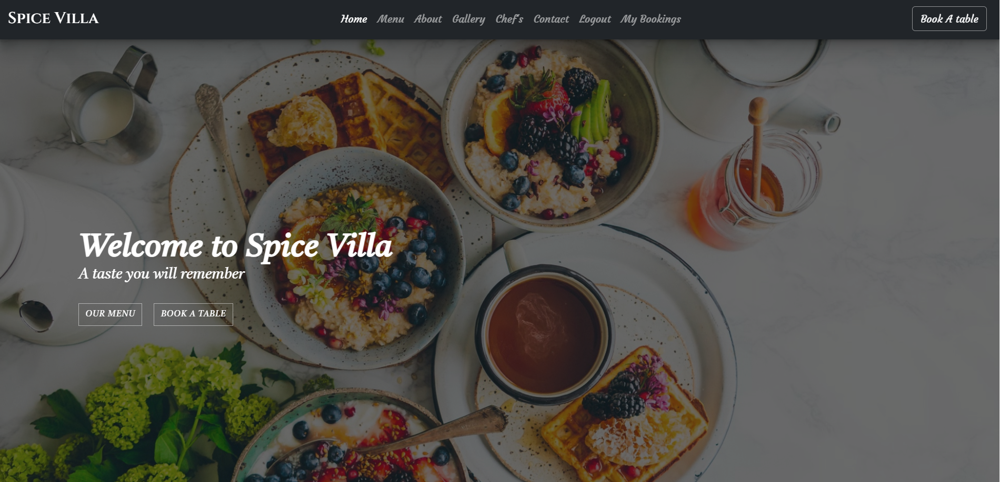
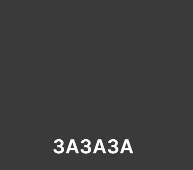
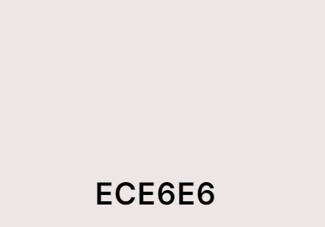
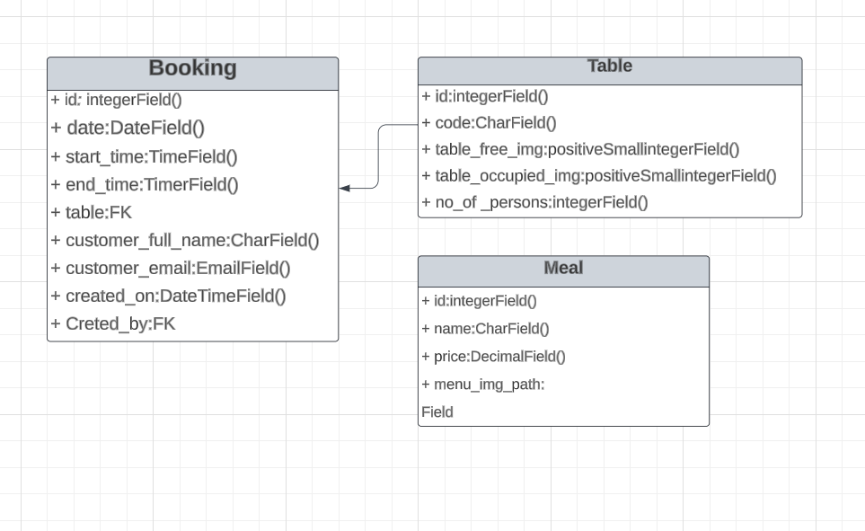
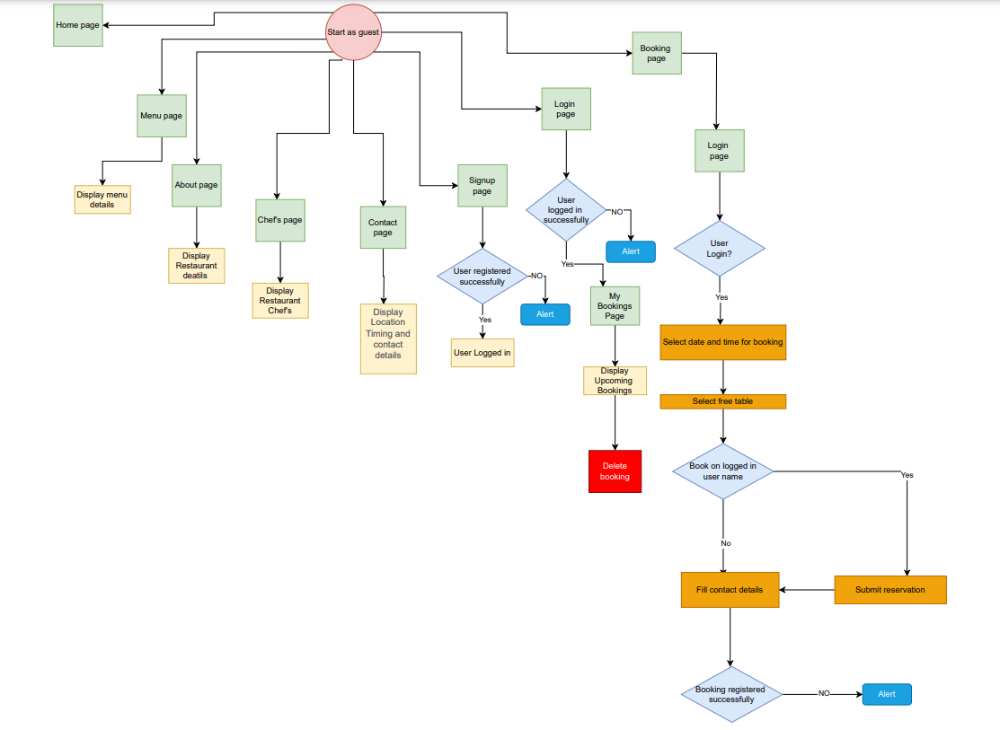

<h1 align="center"> Spice villa - Booking website</h1>

 

The fully deployed project can be accessed at [This link](https://spice-villa-c8a666e63481.herokuapp.com/). 

## Developer: Dhvani Intwala

---

## [Content](#content)

- [Overview](#overview)
- [User Experience (UX)](#user-experience-ux)
  - [Project goals](#project-goals)
  - [User Stories](#user-stories)
  - [Agile Methodology](#agile-methodology)
  - [Design](#design)
    - [Wireframes](#wireframes)
    - [Database Schema](#database-schema)
    - [Flowchart](#flowchart)
- [Features](#features)
  - [Future Features](#future-features)
- [Technologies Used](#technologies-used)
  - [Languages](#languages)
  - [Frameworks Libraries Programs](#frameworks-libraries-programs)
- [Testing](#testing)
- [Deployment](#deployment)
  - [Deploy on heroku](#deploy-on-heroku)
  - [Fork the repository](#fork-the-repository)
  - [Clone the repository](#clone-the-repository)
- [Credits](#credits)
  - [Code](#code)
  - [Media](#media)
  - [Acknowledgements](#acknowledgements)

## Overview

This is a project designed and developed to create a complete experience for Spice Villa Restaurant customers. Users have the ability to view the restaurant's menu, create, edit and delete a booking. All of these functions can be accessed by any user with an account, with the administrator having special rights to control the data.

The website was created for real situations, but the name of the restaurant is fictitious.

Spice Villa - booking website was developed using Python (Django), HTML, CSS and JavaScript and stores the data in a PostgreSQL database.

## User Experience

### Project goals

The overall goal of the website is to create a restaurant website that is enticing to visitors and creates interest and curiosity to visit the restaurant. Visitors should be able to find general information about the restaurant and the menu. In addition, visitors should be able to make a table reservation directly on the website. 

### User Stories
- Goals for first-time visitors
    - As a first-time visitor, I can read and learn about the place and the history of the restaurant and get a feel for the restaurant.
    - As a first-time visitor, I can find out what type of food is on the the menu.
    - As a first-time visitor, I can find information about how to make a reservation at the restaurant.

- Destinations for returning visitors
    - As a returning visitor, I can create an account so I can make a reservation online.
    - As a returning visitor, I can look at the menu to see if it has changed.

- Goals for frequent visitors
    - As a regular visitor, I can log in and view my current bookings.
    - As a frequent visitor, I can change or cancel my booking on the login page

### Agile methodology

This project was developed using the agile methodology.
All progress in implementing Epics and User Stories was captured using Trello. Necessary goals and priorities were well defined throughout the project. In addition, labels were used to define the priority of each user story on the Kanban board. As user stories were completed, they were moved from the To Do, Progress, and Done lists in the Trello board.

### Design

The themes for the project were chosen in accordance with the intended target audience for the restaurant. With its fancy look, dark colours and luxurious details and effects, the theme fits perfectly with the goal of giving visitors the impression that this is a very high-end restaurant.

The primary colour scheme was used for most of the text on the website, in either dark or light colours to create a good contrast. 

 
 
 

The secondary colour scheme was used for buttons, warnings, errors or for highlighting important information.

 
 
 

### Wireframes
The wireframes for mobile and desktop were created with [Balsamiq](https://balsamiq.com/) tool and can be viewed [here](/static/wireframes/wireframe.pdf) 

### Database Schema
The project uses the relational database PostgreSQL to store the data.
Two diagrams were created to show the relationships between the tables.

Schema

 

### Flowchart
I created the flowchart for my website's functionality using LucidChart and it visually represents how the system works.

Flowchart

 

## Features

### Navbar

- The navigation bar displays all the sections that the user can enter, providing a quick and easy way to
 navigation on the website. The link to the booking is enlarged so that it is particularly easy to find and use.

  

### Hero

The Hero section provides a good first impression of the website and thus the restaurant for the visitor.
It also includes the links that the user is likely to need most often, namely the menu link and a table reservation link.

### Menu

On the Menu page there is a list of all the menu items. Each item represents a meal with details such as name, picture, price and ingredients. The design of the list is simple and attractive.

### About

The about section tells more about the restaurant and incorporates some of the design to further
enhance its unique selling points.

### Testimonials

Testimonials show what previous customers have to say about the restaurant and are a method of providing social proof and increasing customer conversion on the website.

### Gallery

In the gallery, visitors can see examples of interior design and learn what the restaurant looks like.

### Contact

The contact area contains all the necessary information about the restaurant that the visitor needs to know.

### Account signup/Login

In the account pages, the user can create an account in order to reserve a table, as well as log in as an existing user.

###  Login page

The user accounts were created using the django allauth module. In this way, information about the current user can be retrieved from the template and displayed to confirm that the authentication was successful.
Considering that the website is created for a restaurant, the user's profile is created to display important information such as name and email.

### Book a Table

Any user who is authenticated can access the booking page to make a reservation. This feature
 provides a form with several sections that appear one after the other as steps to complete the booking.
The first section is used to select the date and period for the booking

- The inputs are validated according to the following rules:
 - The date value should not be less than the current day;
 - For the current day, the start hour should not be smaller than the current hour;
 - The end hour must be greater than the start hour;
 - Start hour and end hour must be between 9:00 AM and 11:00 PM;

The next section appears only if the previous one is valid, and displays the tables available in the restaurant in the colour corresponding to their availability status. The user can now select a table from the drop-down list, as it contains only the available tables. There is also a read-only input with a value indicating the number of seats for each selected table, as an informative element.

Another part of the form is displayed with the contact information to be filled in. A better alternative for users who already have an account is to book by clicking the Book on my name button. This means that the form will automatically register the authenticated user's name and email address as contact information.

The last section contains an overview of the reservation. When the reservation has been sent, a success message appears.

### Mybookings

A customer's current bookings are displayed on the mybooking page so that the customer can get an overview of all bookings and check the date and time, etc. for each booking. On this page, the customer can also click on the "edit" button and make the necessary changes to the booking, which are then saved and displayed on the "My Bookings" page. The customer can also delete a booking by clicking on the "Delete" button. It will then disappear from the list of reservations.

The delete button triggers a modal for confirmation, that being a part of the defensive programming.

If the bookings list is empty, a suggestive message is displayed.

### Footer

The footer contains the most important information about the restaurant and provides easy access to the most
relevant contact information and social media links on all pages of the website.

## Future Features

- -Add a contact form on the main page so visitors can email the restaurant directly on the website.
- When a customer books a table, they will receive an email notification.
- Update the booking feature with a more complex algorithm and design for generating available tables. The current algorithm sets a table as occupied even if it is only registered as booked for a small portion of the interval requested by the user for the reservation. Also, the start and end times are limited to zero hundred hours. Changing the limit to zero to thirty hours will make the algorithm more efficient.

## Technologies Used

### Languages

- Python
- Django
- JavaScript
- HTML5
- CSS3

### Frameworks, Libraries, Programs
- Python Built-in Modules:
  - [os](https://docs.python.org/3/library/os.html) 

- External Packages
  - [cloudinary](https://pypi.org/project/cloudinary/1.29.0/) 
  - [dj-database-url](https://pypi.org/project/dj-database-url/0.5.0/) 
  - [dj3-cloudinary-storage](https://pypi.org/project/dj3-cloudinary-storage/0.0.6/) 
  - [Django](https://pypi.org/project/Django/3.2.14/) 
  - [django-allauth](https://pypi.org/project/django-allauth/0.51.0/)
  - [gunicorn](https://pypi.org/project/gunicorn/20.1.0/)
  - [psycopg2](https://pypi.org/project/psycopg2/2.9.3/) 

### Programs & Tools

- [Google Fonts:](https://fonts.google.com/)
  - Was used to to incorporate font styles.  
- [Bootstrap](https://getbootstrap.com/)
  - Was used to create the front-end design.
- [GitPod:](https://gitpod.io/)
  - Gitpod was used as IDE to commit and push the project to GitHub.
- [GitHub:](https://github.com/)
  - Was used for all storing and backup of the code pertaining to the project.
- [Balsamiq:](https://balsamiq.com/)
  - Was used to create wireframes
- [LucidCharts:](https://www.lucidchart.com/)
  - Was used to create the database schema.

## Testing
The testing documentation can be found at [TESTING.md](TESTING.md)

## Deployment

### Deploy on Heroku

1.  Create Pipfile

In the terminal enter the command ` pip3 freeze > requirements.txt`, and a file with all requirements will be created.

2. Setting up Heroku

   - Go to the Heroku website (https://www.heroku.com/)
   - Login to Heroku and choose _Create App_
   - Click _New_ and _Create a new app_
   - Choose a name and select your location
   - Go to the _Resources_ tab
   - From the Resources list select _Heroku Postgres_
   - Navigate to the _Deploy_ tab
   - Click on _Connect to Github_ and search for your repository
   - Navigate to the _Settings_ tab
   - Reveal Config Vars and add your Cloudinary, Database URL (from Heroku-Postgres) and Secret key.

3. Deployment on Heroku

   - Go to the Deploy tab.
   - Choose the main branch for deploying and enable automatic deployment
   - Select manual deploy for building the App

### Fork the repository

For creating a copy of the repository on your account and change it without affecting the original project, use<b>Fork</b> directly from GitHub:

- On [My Repository Page](https://github.com/useriasminna/italianissimo-booking-website), press <i>Fork</i> in the top right of the page
- A forked version of my project will appear in your repository  

### Clone the repository

For creating a clone of the repository on your local machine, use<b>Clone</b>:

- On [My Repository Page](https://github.com/useriasminna/italianissimo-booking-website), click the <i>Code</i> green button, right above the code window
- Chose from <i>HTTPS, SSH and GitClub CLI</i> format and copy (preferably <i>HTTPS</i>)
- In your <i>IDE</i> open <i>Git Bash</i>
- Enter the command <code>git clone</code> followed by the copied URL
- Your clone was created

## Credits

- The texts and images that are used for testimonials were taken from google.

### Code

- [Django Documenation](https://www.djangoproject.com/) was used to provide examples of code solutions and Django functionality.
- [Bootstrap Documenation](https://getbootstrap.com/) was used to provide examples of Bootstrap functionality and building blocks.
- [Code Institute walkthrough](https://codeinstitute.net/) as inspiration and code examples, the code institute walkthroughs "Hello Django" and "I Think Therefore I Blog" was used.

### Media

- Most of the pictures for the project was taken from [Pexels] (https://www.pexels.com/) and [Pixabay] (https://pixabay.com)

### Acknowledgements

- The tutor support team at Code Institute for their support.
- My Code Institute Mentor for feedback and suggestions.
- The Code Institute Slack community.

[Back to top](#content)
